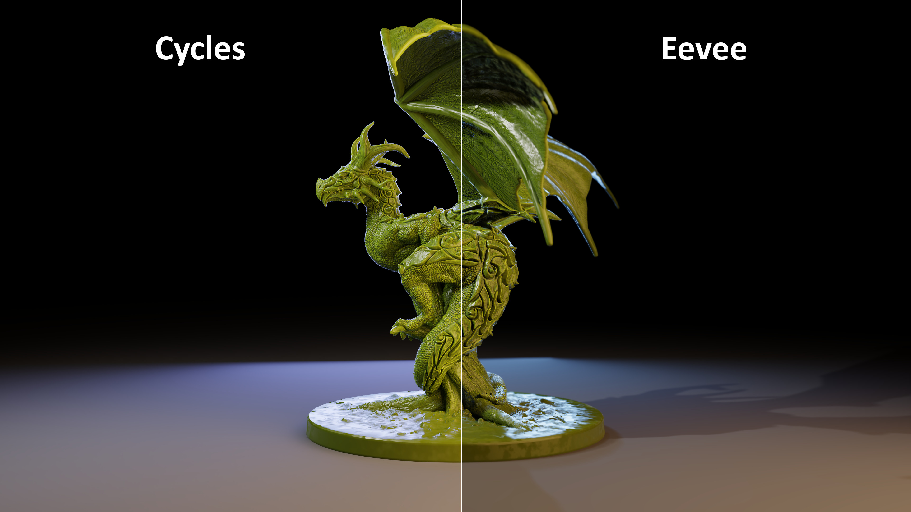

# 제목: 3D 컴퓨터 그래픽 제작 소프트웨어 Blender 조사 및 연구

## 팀원     
* 생물학과 / 2024005769 / 정대성 (wire-1020)  
* 생물학과 / 2024005535 / 조성모 (smcho0105)   
* 생물학과 / 2024006453 / 강나현 (Nahyun0128)   
* 생물학과 / 2024009409 / 강서현 (PolarBK)    
* 생물학과 / 2024013652 / 이채원 (chaewon0713)

## 1.개요   
&nbsp; Blender 재단 및 법인에서 개발한 3D 컴퓨터 그래픽을 제작하는 프로그램이다.

## 2.라이선스   
&nbsp; 오픈 소스 GNU GPLv2을 사용 중이다.

## 3.주요기능   
### 1. 모델링(Modeling)   
...   블렌더의 종합적인 모델링 기능을 사용하면 사용자는 아주 손쉽게 자신의 모델을 창조하고, 변형하고, 편집할 수 있다. 모델링은 3D 분야에서 가장 중요한 세개의 요소인 모델, 물질, 빛 중 모델을 구현할 수 있게 하는 도구들을 모아놓은 기능이다. 모델링은 실제 물체를 모방하거나 추상적인 물체에 대한 상상력을 표현할 수 있게 하는 기술이자 과학이다. 블렌더는 개체의 유형에 따라 다양한 모드들을 제공하여 사용자가 그것을 구현하도록 도와준다. 예외적으로, 스피커, 카메라, 램프는 구현되지 않지만 그 밖의 대부분의 유형들을 구현할 수 있다. 

편집모드는 모델링의 메인이 되는 모드이다. 이 모드은 그물, 곡선, 표면, 메타볼, 본문 객체, 격자 등의 형태를 편집하는데 사용된다.
사용자는 메시 모델링의 원, 정육면체, 원통 등의 기본형을 기반으로 더 크고 복잡한 모형을 편집으로 만들어낼 수 있다. 모든 물체는 메시 구조로 표시되는데, 이것은 정점, 가장자리, 면으로 모든 것이 구축된다는 것이다. 정점은 물체가 삼차원의 좌표 공간에 배열되는 것을 돕고, 두 정점을 연결하면 가장자리가 되며, 이 가장자리들을 연결하면 면이 만들어진다. 이 모든 과정의 개수를 늘리고, 복사하는 등 편집하여 물체를 완성시킨다.
메시 과정에서 다각형의 모양으로 물체를 편집했다면 곡선 과정에서는 부드러운 표면을 가진 물체들을 편집할 수 있다. 메시 과정보다 더 적은 데이터를 사용한다는 장점이 있지만, 동시에 더 다양한 미세조정을 할 수 없다는 단점을 가지고 있다. 블렌더는 문자나 로고를 만들 때 사용하는 베지어(Bézier) 곡선과 높은 유연성과 정밀성을 통해 다양한 산업에 쓰이는 비균일 유리 B-스플라인(NUBRS) 곡선을 모두 제공한다. 
### 2. 스컬프팅(Sculpting)   
...스컬프팅이란 디지털 제작 파이프라인의 여러 단계에서 필요한 유연성과 같은 기능을 제공한다. 스컬프팅 작업에선 입체모형을 누르거나 무늬를 내는 등 다양한 방식으로 변형하여 형태를 제작한다. 주로 동식물이나 인간의 신체를 제작하는데 많이 쓰이며 돌이나 지형 같은 자연물을 제작하는데도 용이하다. 스컬프팅은 편집요소와 유사하지만 브러시를 이용해서 형태를 변경할 수 있다는 점이 차별점이다.   
스컬프팅에는 다음과 같은 기능들이 포함된다. 첫번째로 20가지의 브러시가 장착되어있다. 대표적으로 Blob으로 구의 형태로 대상의 바깥쪽 혹은 안쪽으로 모양을 내는 브러시가 있다. 또 Flatten 브러시는 브러시 영역 내의 정점 위/아래의 평균 높이에 기본적으로 위치한 면적 평면을 결정한다. 그런 다음 정점은 이 평면을 향해 당겨지는 기능을 한다. 이를 통해 이용자들만의 독창적인 입체모형을 제작할 수 있다.   
두번째로 동적 토폴로지 (Topology, 폴리곤의 연결 관계) 기능이 포함되어 있다. 이는 동적 테셀레이션 스컬프팅 방식으로 제작 과정에서 즉석으로 세부 사항을 추가하고 제거할 수 있다.   
마지막으로 Masking 기능이다. 이는 스컬프팅 과정에서 한 영역이 다른 영역으로부터 숨겨지거나 두 영역사이가 너무 가까울 때의 문제점을 해결하기위한 방식이다. Masking은 스컬프팅하는 영역을 유용하게 분리하여 이러한 문제점을 해결할 수 있다.   
### 3. 리깅(Rigging)   
...   리깅이란 대상으로 하는 오브젝트의 뼈대를 만드는 작업을 뜻한다.   
리깅 작업은 동작을 할 입체 모형이 움직임을 취할 수 있게 해준다. 간단히 말하면 입체 모형의 뼈와 관절을 만들어주는 작업이라고 할 수 있다. 별도로 스키닝이라고도 표현하는 각 뼈와 피부를 연결해주는 작업도 있다. 블렌더는 각각의 뼈가 아닌 뼈대 하나를 한 오브젝트로 취급하며 뼈대(Armature) 오브젝트를 추가함으로써 리깅 작업을 실행할 수 있다. 뼈대 오브젝트 편집모드를 이용해 각각의 뼈를 수정할 수 있으며, 각각의 뼈가 뼈대에서의 기존 위치를 기억하므로 초기화하기도 용이하다. 
### 4. 애니메이팅(Animating)   
...   애니메이팅은 이전 우리가 모델링, 리깅 등을 이용해 만든 입체 모형이 시간에 따라 움직일 수 있도록 해주는 작업이다. 
### 5. 물리 시뮬레이션(Physics)   
...  물리 시뮬레이션이란 실제 물리적 시뮬레이션을 의미하는 것이 아니라 그래픽으로 물리효과를 보여주는 작업이다. 속도, 중력, 바람으로 인한 현실의 각종 충돌, 흐름, 펄럭임 등을 시각적으로 시뮬레이션 할 수 있기에 사용자는 실제 세계의 물리 법칙을 따르는 움직임과 상호작용을 3D 장면에 적용할 수 있다. 물리 시뮬레이션에는 강체, 유체, 연체, 불과 연기(smoke), 의류, 헤어 시뮬레이션 등의 기능이 있다. 
 강체 시뮬레이션은 외부 힘에 영향을 받아 형태가 변하지 않는 물체에 사용된다. 밀도와 질량을 지정할 수도 있고, 물체가 충돌하거나, 
파괴되는 장면에서 사용된다. 유체 시뮬레이션은 말 그대로 꿀, 물 등의 액체가 흐르는 장면에 사용되는 기능이다. 
 연체 시뮬레이션은 힘이 가해지면 형태가 변하거나 변형되는 쿠션, 공, 풍선 등의 부드러운 물체를 표현할 때 사용된다. 현실적인 변형, 늘리기, 굽히기 등과 같은 행동을 시뮬레이션 하기 좋아 캐릭터 애니메이션, 특수 효과 또는 유연성이나 부드러움을 현실적으로 나타내는 장면에 주로 사용한다. 그리고 탄성이나 내부 기압 값을 지정할 수도 있다.
  불과 연기 시뮬레이션은 불이 튀는 장면이나 연기가 피어오르는 장면에서 사용된다. 그 덕에 실감나는 연기와 불꽃 효과를 생설할 수 있고, 연기와 불의 밀도, 색상, 확장 속도 등을 조절할 수 있다.
 의류, 헤어 시뮬레이션은 둘 다 바람이 흔들리거나 움직임에 반응 할 때 사용된다. 그 중 의류는 옷, 커튼, 깃발 등이 바람이나 물체와 상호작용하는 장면에서 많이 사용된다. 
천의 탄성, 마찰, 접힘과 같은 속성을 조절하여 다양한 장면을 표현할 수 있다. 헤어 시뮬레이션은 머리카락, 잔디, 털의 움직임을 표현할 수 있다. 헤어도 마찬가지로 바람과 상호작용하는 장면에 주로 사용된다. 머리카락의 길이, 굵기, 곡률, 색상을 조정할 수 있고 스타일까지 만들 수 있다.
### 6.렌더링(Rendering)
&nbsp;렌더링이란 3D 혹은 2D 모델을 2D 이미지로 변환하는 것을 의미한다. 렌더링의 방식에는 여러 종류가 있지만, 블렌더에서는 3종류의 렌더링을 기본으로 제공한다. EEVEE 렌더링과 Cycles 렌더링 그리고 Workbench 렌더링 방식이다. 사용자는 3종류의 렌더링을 필요한 상황에 적절하게 이용하여 쾌적한 작업환경을 만들고 좋은 작업물을 만들 수 있다.  
  
&nbsp;EEVEE는 ‘Extra Easy Virtual Environment Engine’의 약자로 속도와 상호작용에 초점을 맞춘 렌더링 엔진이다. EEVEE는 블렌더 2.80버전부터 포함된 실시간 렌더링 엔진이다. 렌더링에 걸리는 시간이 매우 짧기 때문에 실시간으로 화면을 돌려보거나 움직이는 것이 자유로운 것이 특징이다. 또한 EEVEE은 실시간 렌더링 엔진이지만 광원 처리 등이 매우 자연스럽다는 특징을 가지고 있다. 물론 기존의 Cycles엔진에 비하면 부자연스러운 부분이 있지만, 보다 적은 컴퓨팅 자원을 사용하여 훌륭한 결과물을 낼 수 있다.  
  
&nbsp;Cycles는 광선추적방식(Ray Tracing)의 렌더링 엔진이다. 광선추적방식은 광원에서 가상의 광선이 모델링한 물체의 표면에 반사되어 나와 카메라에 도달하는 경로를 계산하여 물체를 렌더링하는 방식이다. 간단하게 말해서 현실에서 우리가 물체를 보는 방식을 최대한 비슷하게 재연한 방식이다. 이러한 렌더링 방식의 원리 때문에 Cycles 엔진은 블렌더에서 제공하는 3가지 방식의 렌더링 중 가장 현실적으로 물체를 렌더링하는 방식이지만 동시에 렌더링의 시간이 가장 오래 걸리고 컴퓨팅 자원을 가장 많이 차지한다는 단점이 있다. 따라서 실시간 렌더링에는 적절하지 않고 최종작업물을 만들기 위해 많이 채택하는 렌더링 엔진이다. 블렌더 3.0 버전에서부터는 Cycles X라는 프로젝트를 통해 렌더링의 속도를 절반에서 1/5까지 줄이는 효과를 보았다.  

## 4.출처
https://docs.blender.org/manual/nb/2.79/modeling/index.html (Blender 2.79 Manual - Modeling)  
https://code.blender.org/2021/11/cycles-x-project-update/ (Cycles X Project Update)  
https://en.wikipedia.org/wiki/Ray_tracing_(graphics) (Ray Tracing - Wiki)  
https://www.blender.org/features/simulation/ (Simulations)  
https://ko.wikipedia.org/wiki/%EB%B9%84%EA%B7%A0%EC%9D%BC_%EC%9C%A0%EB%A6%AC_B-%EC%8A%A4%ED%94%8C%EB%9D%BC%EC%9D%B8 (위키백과 - 비균일 유리 B-스플라인)
